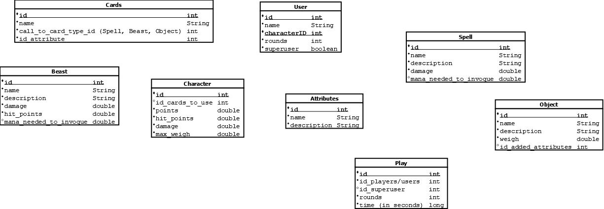

# d20cards
### Designed and implemented by Carlos, Pau L. And Pau G.

## Phase 1. Situation analysis and prototyping of the information system.

### 1. Choosing information system

* We have chosen to implement a database for card games such as *Magic* or *Wharhammer* mostly based on d20 steriotypical board games.
  
> Our reason for choose this topic is largely related to the basic knowldage of this theme, and the potentially interesting outcome of the project: being able to move the cards onto a machine and create new cards to make the game more challenging, or perhaps assist the DM *(Dungeon Master)* in creating  in creating enemies for upcoming one-shots or campaigns.

>Beyond the basics we also like the idea of a more complex build and handling the likely overwhelming number of items we'll need to manage 

* Ideally this database will manage: 
  
|Table|Attributes |
|----|----|
|Cards|id, Name, call to card type(an id) |
|User|id, Name,CharacterID, rounds, *is he/she a DM?* |
|Spell|id, Name, description, dmg, mana needed to invoque |
|Beast|id, Name, description, dmg, hp, mana needed to invoque |
|Object|id, Name, description, weigh, added attributes |
|Character|Cards to use, points, hp, dmg, max weigh, badOmens |
|Play|characters, users, rounds, numberofcards, active? |
|Effects|id, name, description|

This should work as:  
1.  User logs in and  creates a character with name.
2.  Then the  user will ask a number of cards  given to him randomly
3.  After, the user will join a playthrough with simmilar cards number 
    * The user rounds and play rounds will increase as the timer adds 20 minutes per round.
    * Example: User1 and User2 are in an active play. User1 chooses to attack User2's beast, which has 6 hp, while User1's beast has 4 hp. If the attack is successful, User2's beast will be discarded, and User2 will lose 2 hp.
    * Example: In retaliation, User2 casts a spell to freeze User1's beast. This results in the death of User1's beast, and the freeze effect reduces User1's mana by 1 point.
    * Any user is able to do a *mulligan*(Discard hand and recieve new ones, no posibility of recalling the first hand) in round 1. Once a card is used, it will go to the graveyard and can no longer be played.
    * Once every 10 rounds the users will be able to draw more cards, but they can never exceed the number of cards chosen at the start.
  

### 3. Methodologies
  We had already thought about this topic beforehand, so it was relatively easy to manage. We developed three different versions and combined the best elements from each.

- For this we used git as versions control.
- Vscode for typing the README and scripts.
- dia for the E-R.
- Excel for the basic typo of the database.

> It is sort of difficult for us to present the original version as it emerged brainstorm.

### 4. Results

Now we´ll see a previous version of  the tables:

And Added the cardinality of these tables.

At firs we had some difficulties understanding how it should work but we believe the versions have been upgraded and we've learned a better aproach for implementing the idea,

#### v1 d20cards
Originally  we envisioned having a character, two types of cards, and gameplay based exclusively on _RNG_ (random number generation) or luck, but this seemed a bit dull.

This version came from a brainstorming session.

#### v2 d20cards
Here we wold start to write the introduction with a few more ideas and we began working on the skeleton of the diagram, having a clearer idea of what we wanted to accomplish.

[See dia image](#4-results)

> We enjoy challenge :D  
>So.. This can be done extremely easy or turn into a nightmare (probably the latter).  
>There hasn't been any significal changes so far.
